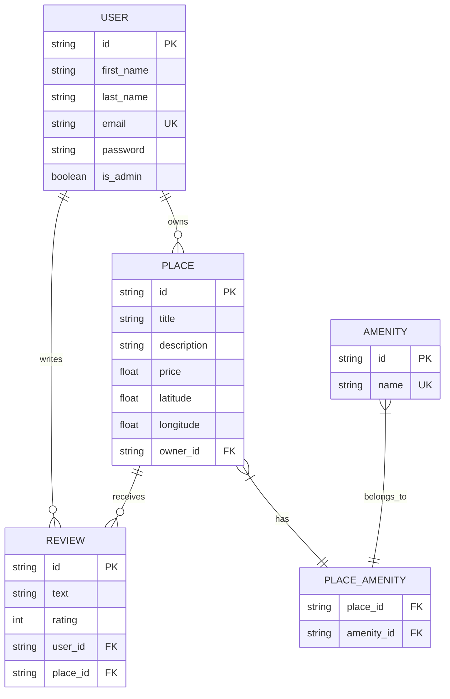

# HBnB Evolution 🏠

A comprehensive AirBnB-like application built with Flask, SQLAlchemy, and JWT authentication, featuring a clean three-layer architecture and dual database implementation.

## 📋 Overview

HBnB Evolution is a full-stack property rental platform that enables users to:
- Manage property listings with location and pricing
- Search and filter places with various criteria
- Write and read reviews with rating system
- Manage property amenities through many-to-many relationships
- Secure authentication with JWT tokens and role-based access

## 🏗️ Architecture

The application follows a **three-layer architecture** with dual database implementation:

```
┌─────────────────────────┐
│   Presentation Layer    │
│      (REST API)         │
└───────────┬─────────────┘
            │
┌───────────▼─────────────┐
│  Business Logic Layer   │
│   (HBnBFacade + Models) │
└───────────┬─────────────┘
            │
┌───────────▼─────────────┐
│   Persistence Layer     │
│ (SQLAlchemy + Raw SQL)  │
└─────────────────────────┘
```

### Key Components

- **REST API**: Flask-RESTX with Swagger documentation
- **Authentication**: JWT tokens with role-based access control
- **Business Logic**: HBnBFacade pattern coordinating operations
- **Data Models**: SQLAlchemy ORM with relationship mapping
- **Dual Persistence**: Both SQLAlchemy ORM and raw SQL implementations
- **Testing Suite**: Comprehensive test coverage with automated validation

## 🚀 Features

### User Management
- User registration with email validation
- JWT-based authentication system
- Profile management with role-based permissions
- Admin user support with elevated privileges

### Place Management
- Create, update, and delete property listings
- Geographic coordinates with validation
- Dynamic pricing management
- Multi-amenity association support

### Review System
- Submit reviews with 1-5 star ratings
- Business rule: One review per user per place
- Users cannot review their own properties
- Automatic relationship management

### Amenity Management
- Create and manage amenities (WiFi, Pool, etc.)
- Many-to-many relationships with places
- Admin-only amenity management

### Advanced Features
- **Relationship Management**: Automatic loading of related entities
- **Data Validation**: Model-level and API-level validation
- **Security**: Password hashing, JWT tokens, protected endpoints
- **Documentation**: Auto-generated Swagger API documentation

## 📊 Database Design

### Dual Database Implementation

#### SQLAlchemy ORM Database
- **Location**: `./instance/development.db`
- **Features**: Automatic relationship loading, migration support
- **Tables**: Users, Places, Reviews, Amenities, Place_Amenity junction

#### Raw SQL Database  
- **Location**: `./sql_scripts/hbnb_raw_sql.db`
- **Features**: Pure SQL implementation, manual optimization
- **Purpose**: Educational comparison and performance baseline

### Entity Relationships



## 🔗 API Endpoints

### Authentication
- `POST /api/v1/auth/login` - User authentication with JWT
- `GET /api/v1/auth/protected` - Protected endpoint testing

### Users
- `POST /api/v1/users/` - Create user (Admin only)
- `GET /api/v1/users/` - List all users
- `GET /api/v1/users/{id}` - Get user details
- `PUT /api/v1/users/{id}` - Update user (Self or Admin)

### Places
- `POST /api/v1/places/` - Create place (Authenticated)
- `GET /api/v1/places/` - List all places (Public)
- `GET /api/v1/places/{id}` - Get place details (Public)
- `PUT /api/v1/places/{id}` - Update place (Owner or Admin)

### Reviews
- `POST /api/v1/reviews/` - Submit review (Authenticated)
- `GET /api/v1/reviews/` - List all reviews (Public)
- `GET /api/v1/reviews/{id}` - Get review details (Public)
- `PUT /api/v1/reviews/{id}` - Update review (Author or Admin)
- `DELETE /api/v1/reviews/{id}` - Delete review (Author or Admin)
- `GET /api/v1/reviews/places/{place_id}/reviews` - Get reviews for place

### Amenities
- `GET /api/v1/amenities/` - List amenities (Public)
- `POST /api/v1/amenities/` - Create amenity (Admin only)
- `GET /api/v1/amenities/{id}` - Get amenity details (Public)
- `PUT /api/v1/amenities/{id}` - Update amenity (Admin only)

## 🛡️ Security & Business Rules

### Authentication & Authorization
- **JWT Tokens**: Secure authentication with expiration
- **Role-Based Access**: Admin vs Regular user permissions
- **Protected Endpoints**: Require valid authentication
- **Owner Permissions**: Users can only modify their own content

### Business Rules
1. **Email Uniqueness**: Each email can only be registered once
2. **Review Restrictions**: 
   - Users cannot review their own places
   - One review per user per place
3. **Admin Privileges**: Only admins can manage users and amenities
4. **Data Validation**: Strict validation at model and API levels

### Data Integrity
- **Foreign Key Constraints**: Enforce referential integrity
- **Cascade Operations**: Automatic cleanup of related data
- **Input Validation**: Comprehensive validation rules
- **Geographic Constraints**: Latitude/longitude range validation

## 🚦 HTTP Status Codes

- `200 OK` - Successful GET request
- `201 Created` - Resource successfully created
- `400 Bad Request` - Invalid request data or business rule violation
- `401 Unauthorized` - Authentication required
- `403 Forbidden` - Insufficient permissions
- `404 Not Found` - Resource not found
- `409 Conflict` - Conflict with existing data

## 🔧 Setup & Installation

### Prerequisites
- Python 3.8+
- pip package manager
- Git

### Installation

```bash
# Clone the repository
git clone https://github.com/flockwood/holbertonschool-hbnb.git
cd holbertonschool-hbnb/part3

# Create virtual environment (recommended)
python -m venv venv
source venv/Scripts/activate  # Windows
# source venv/bin/activate     # macOS/Linux

# Install dependencies
pip install -r requirements.txt

# Initialize SQLAlchemy database
python scripts/migration_script.py

# Initialize raw SQL database (optional)
cd sql_scripts
python simple_sql_setup.py
cd ..

# Start the application
python run.py
```

### Default Admin Credentials
- **Email**: `admin@hbnb.com`
- **Password**: `admin123`

### Verification
```bash
# Quick system verification
python tests/quick_system_check.py

# Run all tests
python tests/run_all_tests.py
```

## 🧪 Testing

### Organized Testing Suite

The project includes a comprehensive testing infrastructure with organized test categories:

```bash
# Master test runner (runs all test suites)
python tests/run_all_tests.py

# Individual test categories
python tests/quick_system_check.py          # System health (4 checks)
python tests/comprehensive_test_suite.py    # Full testing (35 tests)
python tests/test_jwt_auth.py               # JWT authentication
python tests/test_password_hashing.py       # Password security
python tests/test_admin_endpoints.py        # Admin functionality
```

### Test Coverage Results

**Latest Test Results: 35/35 Tests Passed (100%)**

- **🗄️ DATABASE (16/16)**: SQLAlchemy & Raw SQL databases
- **🚀 FLASK_APP (2/2)**: Server startup & API documentation  
- **🔐 AUTH (4/4)**: JWT authentication & admin privileges
- **🌐 API_ENDPOINTS (9/9)**: All CRUD operations functional
- **🔗 RELATIONSHIPS (4/4)**: Complex database relationships

### Database Testing
```bash
# SQLAlchemy database exploration
python utils/explore_db.py

# Raw SQL database exploration  
cd sql_scripts && python explore_db.py

# Database migration testing
python scripts/migration_script.py
```

### API Testing
- **Swagger UI**: http://127.0.0.1:5000/api/v1/
- **Endpoints**: All endpoints accessible via REST client
- **Authentication**: JWT token-based testing included

## 📈 Performance & Scalability

### Database Optimization
- **Indexes**: Strategic indexing on frequently queried fields
- **Relationship Loading**: Optimized SQLAlchemy relationship loading
- **Query Optimization**: Efficient join operations

### Scalability Features
- **Modular Architecture**: Easy to extend and modify
- **Repository Pattern**: Abstracted data access layer
- **Facade Pattern**: Simplified business logic interface

## 🎯 Project Structure

```
part3/
├── app/
│   ├── __init__.py              # Flask app factory
│   ├── api/v1/                  # API endpoints
│   │   ├── users.py            # User management endpoints
│   │   ├── places.py           # Place management endpoints
│   │   ├── reviews.py          # Review management endpoints
│   │   ├── amenities.py        # Amenity management endpoints
│   │   └── auth.py             # Authentication endpoints
│   ├── models/                  # SQLAlchemy models
│   │   ├── base.py             # Base model with common attributes
│   │   ├── user.py             # User model
│   │   ├── place.py            # Place model with relationships
│   │   ├── review.py           # Review model
│   │   └── amenity.py          # Amenity model
│   ├── persistence/             # Data access layer
│   │   ├── repository.py       # Abstract repository pattern
│   │   ├── user_repository.py  # User-specific operations
│   │   ├── place_repository.py # Place-specific operations
│   │   ├── review_repository.py# Review-specific operations
│   │   └── amenity_repository.py # Amenity-specific operations
│   └── services/                # Business logic layer
│       └── facade.py            # HBnBFacade coordination
├── sql_scripts/                 # Raw SQL implementation
│   ├── create_tables.sql        # Schema definition
│   ├── insert_initial_data.sql  # Initial data
│   ├── test_crud_operations.sql # CRUD testing
│   └── simple_sql_setup.py      # Database setup script
├── instance/                    # Flask instance folder
│   └── development.db           # SQLAlchemy database
├── config.py                    # Application configuration
├── run.py                       # Application entry point
├── requirements.txt             # Python dependencies
├── migration_script.py          # Database migration
├── comprehensive_test_suite.py  # Full system testing
├── quick_system_check.py        # Quick health check
└── README.md                    # This file
```

## 🔮 Future Enhancements

### Planned Features
- **Advanced Search**: Filter by price, location, amenities
- **Booking System**: Reservation management with calendar
- **Payment Integration**: Secure payment processing
- **Real-time Notifications**: WebSocket-based updates
- **Image Upload**: Property photo management
- **Geographic Search**: Radius-based location filtering

### Technical Improvements
- **Caching Layer**: Redis implementation for performance
- **API Rate Limiting**: Request throttling
- **Logging System**: Comprehensive application logging
- **Docker Containerization**: Easy deployment
- **CI/CD Pipeline**: Automated testing and deployment

## 📄 License


## 👤 Author

**Fernando Lockwood**
- GitHub: [@flockwood](https://github.com/flockwood)

---

**Built with ❤️ as part of the HBnB Evolution project - A comprehensive full-stack application demonstrating modern web development practices.**